# Azure Route Server and Cisco Meraki vMX Deployment Guide (Preview not production ready)

Authors: Simarbir Singh, Mitchell Gulledge

- [Azure Route Server and Cisco Meraki vMX Deployment Guide (Preview not production ready)](#azure-route-server-and-cisco-meraki-vmx-deployment-guide-preview-not-production-ready)
- [Solution Overview](#solution-overview)
- [Solution Architecture](#solution-architecture)
- [Step 1) Deploy Cisco Meraki Network Virtual Appliances (vMXs) from Azure Marketplace](#step-1-deploy-cisco-meraki-network-virtual-appliances-vmxs-from-azure-marketplace)
- [Step 2) Prep Azure  Route Server Environment (CLI Reference)](#step-2-prep-azure--route-server-environment-cli-reference)
- [Step 3) Deploy Azure Route Server (CLI Reference)](#step-3-deploy-azure-route-server-cli-reference)
- [Step 4) Configure BGP on the Cisco Meraki vMX](#step-4-configure-bgp-on-the-cisco-meraki-vmx)
- [Step 5) Configure BGP Peering on the Azure Route Server (CLI Reference)](#step-5-configure-bgp-peering-on-the-azure-route-server-cli-reference)
- [Troubleshooting](#troubleshooting)
- [Automation](#automation)
- [References](#references)

# Solution Overview

This document encompasses a detailed step by step guide on deploying the Azure Route Server (Currently in Preview) and Cisco Meraki vMXs hosted in the Azure cloud. BGP is utilized to provide resiliency, symmetry and load sharing across vMXs in the Azure cloud.

# Why Azure Route Server

Traditionally, for customers to achieve high availability for Network Virtual Appliances (NVAs) in Azure, an Azure function was utilized to probe the virtual machine connectivity. Based on whether or not a response was seen on the primary VM, the function would rewrite the User Defined Routes in the Azure routing table. This solution technically works, although creates it's own challenges with scalability, manageability and delay. 

Additionally, when adding new sites or even new subnets to existing sites you no longer need to manually update the User Defined Routes in the Azure routing table. Because we are now utilizing BGP to exchange reachability while offering redundancy, symmetry (via AS Path manipulation) and loadsharing across multiple NVAs.

# Solution Architecture
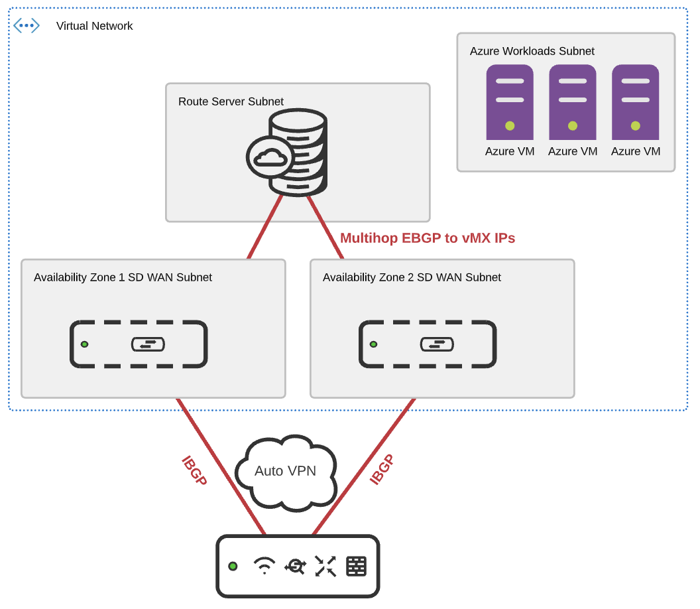

In the above diagram, the branch MX connects to a pair of vMXs deployed in the same VNET across different Availability Zones for redundancy. EBGP has been configured across the vMXs to the route server virtualRouterIps that will be discussed further later. IBGP is formed on top of Auto VPN directly from the Branch to the respective vMXs in the Azure cloud. AS Path manipulation is used to ensure symmetry for the route to Azure and the route back from Azure, this is done in accordance with the concentrator priority that is configured at the branch MX site to site vpn settings. 

# Step 1) Deploy Cisco Meraki Network Virtual Appliances (vMXs) from Azure Marketplace

The steps for deploying virtual MXs from the Azure marketplace are out of scope for this document. For more information on deploying virtual MXs from the Azure marketplace please reference the following link:
https://documentation.meraki.com/MX/MX_Installation_Guides/vMX_Setup_Guide_for_Microsoft_Azure

# Step 2) Prep Azure  Route Server Environment (CLI Reference)

For additional ways to automate or configure through the Azure portal please refer to the Azure Route Server Documentation here:
https://docs.microsoft.com/en-us/azure/route-server/overview

The steps for deploying the route server via the CLI are as follows:

1) Login to your Azure account:

```
az login
```

2) Ensure you are in the correct subscription in Azure

```
az account list
```

3) For the Azure Route Server, a VNET is need in order to host the service. Use the follow command to create a resource group and virtual network. (Use these if you do not already have a virtual network) Below snippets were taken directly from Azure documentation: https://docs.microsoft.com/en-us/azure/route-server/quickstart-configure-route-server-cli

```
az group create -n “RouteServerRG” -l “westus” 
az network vnet create -g “RouteServerRG” -n “myVirtualNetwork” --address-prefix “10.0.0.0/16” 
```

4) Next we must create a subnet inside the VNET to host the route server and obtain the subnet ID. Below are the commands to create the subnet followed by the command to obtain the subnet ID.

```
az network vnet subnet create -g “RouteServerRG” --vnet-name “myVirtualNetwork” --name “RouteServerSubnet” --address-prefix “10.0.0.0/24”  
az network vnet subnet show -n “RouteServerSubnet” --vnet-name “myVirtualNetwork” -g “RouteServerRG” --query id -o tsv
```

# Step 3) Deploy Azure Route Server (CLI Reference)

Now that the Azure Resource Group, VNET, Subnets etc have all been created, the next step is to configure the route server. Below is the CLI command for creating the server:

```
az network routeserver create -n “myRouteServer” -g “RouteServerRG” --hosted-subnet $subnet_id  
```

From Azure: "The location needs to match the location of your virtual network. The HostedSubnet is the RouteServerSubnet ID you obtained in the previous section."

# Step 4) Configure BGP on the Cisco Meraki vMX

The next step is for us to enable Auto VPN (set the vMX to be an Auto VPN Hub on the site to site VPN page) and configure the BGP settings on the Azure vMXs. 

Before we can configure the BGP settings on the Meraki dashboard we need to obtain the BGP peer settings for the route server (peer IPs and ASN). To do this we run the following command using the Azure CLI:

```
az network routeserver show -g “RouteServerRG” -n “myRouteServer” 
```

The output from the above should look like:

```
{
  "addressPrefix": null,
  "allowBranchToBranchTraffic": true,
  "azureFirewall": null,
  "bgpConnections": null,
  "etag": "W/\"xxxxxxx-xxxx-xxxx-xxxxx-xxxxxxx\"",
  "expressRouteGateway": null,
  "id": "/subscriptions/xxxxx-xxxxx-xxx-xxx/resourceGroups/xxxxxxxx/providers/Microsoft.Network/virtualHubs/xxxxxx",
  "ipConfigurations": null,
  "location": "southcentralus",
  "name": "myRouteServer3",
  "p2SVpnGateway": null,
  "provisioningState": "Succeeded",
  "resourceGroup": "RouteServerRG3",
  "routeTable": {
    "routes": []
  },
  "routingState": "Provisioned",
  "securityPartnerProvider": null,
  "securityProviderName": null,
  "sku": "Standard",
  "tags": null,
  "type": "Microsoft.Network/virtualHubs",
  "virtualHubRouteTableV2S": [],
  "virtualRouterAsn": 65515,
  "virtualRouterIps": [
    "10.196.0.4",
    "10.196.0.5"
  ],
  "virtualWan": null,
  "vpnGateway": null
}
```

Noting in the above you will want to grab the virtualRouterAsn and virtualRouterIps for the Meraki BGP config. 

Once these values have been obtained, you will navigate to your virtual appliance in the Meraki Dashboard and navigate to the site to site vpn page, enable Auto VPN by selecting Hub and then scrolling down to the BGP settings. 

Select the dropdown to enable BGP and configure your local ASN (The Meraki Auto VPN Autonomous System) and then configure two EBGP peers with the values that you were able to obtain from above. Below is a screenshot of what the BGP config should look like for both your vMXs:

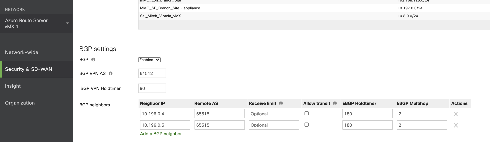

In addition to configuring the BGP settings you will need to add the EBGP peer IPs as local networks on the top of the site to site VPN page. This tells the vMXs that the peer IPs are always reachable through its local Network Interface (NIC) instead of over another VPN tunnel. (This is a requirement for Meraki when Multihop is in play). Below is a screenshot of the local netwoks on the Azure vMX headends:

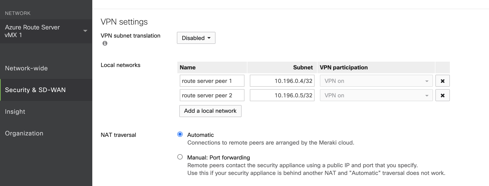

# Step 5) Configure BGP Peering on the Azure Route Server (CLI Reference)

Once, we have the BGP configured on the vMX, the next step would be to configure the route server to peer with the vMX. The following command can be used to establish the peering between the route server and the vMX. 
```
az network routeserver peering create --routeserver-name “myRouteServer” -g “RouteServerRG” --peer-ip “vmx_pip” --peer-asn “vmx1_asn” -n “vmx1_name”
```
- vmx_pip is going to be the private ip of your vMX instance
- vmx_asn is the ASN that was configured for the vMX in the above step

# Troubleshooting

When BGP peering between the Cisco Meraki NVA and the route server is flapping, it is typically due to the hold timer settings on the Meraki dashboard. By default, the Keep-alive timer on Azure Route Server is set to 60 seconds and the Hold-down timer is 180 seconds. (as seen in referenced BGP config)

The session between the NVA and the Azure route server must be an EBGP session. This is due to the fact that the Meraki branches and the vMX in Azure have an IBGP relationship. So in order for the branch to receive the Azure subnets the vMX must be configured in a different ASN than the Azure route server. 

The Cisco Meraki Events Log is a powerful tool for troubleshooting any BGP issues. For flapping BGP sessions the Meraki event log will display when BGP sessions establish and log the BGP Notification messages that were sent and received. This is useful for troubleshooting flapping routes/sessions. Below is a screenshot that shows some sample BGP logs in the Meraki Dashboard:

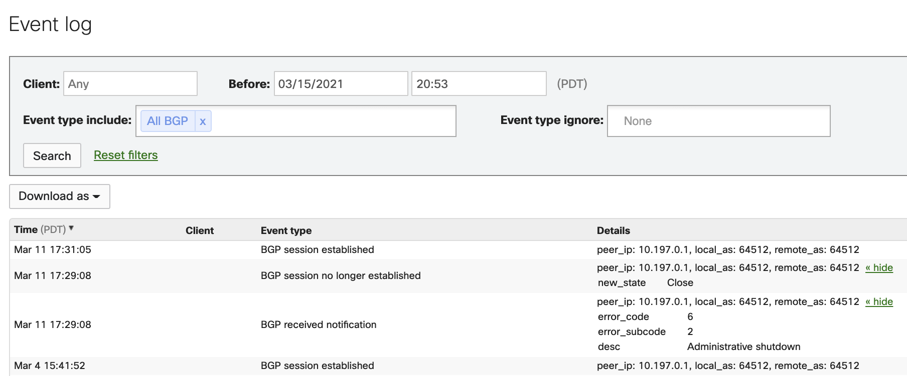

The Notification messages displayed above show the RFC error and sub error codes for why a session was brought down. Below is a link to the RFC:
https://tools.ietf.org/html/rfc4486

Additionally, these BGP logs can be pulled from the Meraki API for integrating with third party monitoring systems:
https://developer.cisco.com/meraki/api-v1/#!get-network-events

For troubleshooting vMX specific issues not related to dynamic routing please refer to the troubleshooting section in the Azure vMX Deployment Guide linked below:
https://documentation.meraki.com/MX/MX_Installation_Guides/vMX_Setup_Guide_for_Microsoft_Azure#Troubleshooting

# Automation 

Nobody likes manually entering remote peer IP and ASN information, whether it is via CLI or GUI. Hence we offer automation option powered by an Azure Function. Below are the steps needed in order to utilize the Meraki BGP Peering automation toolkit. 

Step 1) Obtain Cisco Meraki API Key and Org Name

- The API Key and Org Name will be needed for the script to configure your Meraki device. 

- To view your Organization name navigate to Organization > Settings and the following can be seen:

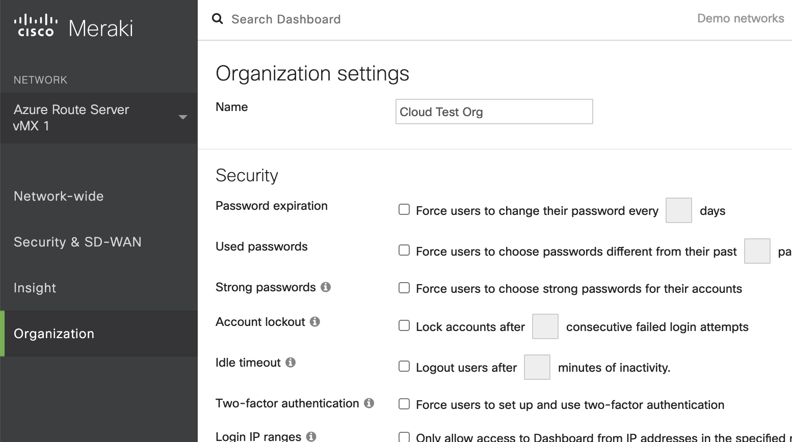

- For access to the API, first enable the API for your organization. 

- Navigate to Organization > Settings > Dashboard API access 

- Enable the API 

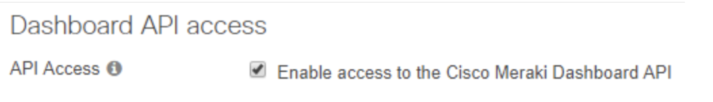

- Navigate to the my profile page and generate an API key 

Note: The API key is associated with a Dashboard administrator account.   

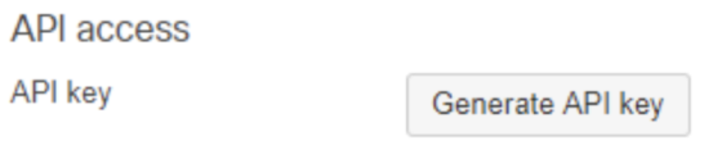

Run the deployment script to create the Azure Function app: 

For automation, Azure Functions are used to run a Python script every 5 minutes to sync the configuration between the Cisco Meraki and Azure Route Server configurations.  An Azure Resource Manager (ARM) Template is used to help facilitate the deployment process and creation of the Azure Function, Azure Route Server, and related peering configurations. 

- To deploy the Azure Function, click on the deploy to Azure button below:


[](https://portal.azure.com/#create/Microsoft.Template/uri/https%3A%2F%2Fraw.githubusercontent.com%2FMitchellGulledge%2FAzure_Route_Server_Meraki_vMX%2Fmain%2Fazuredeploy.json)

- When logged in to the Azure Portal, fill out the required parameters and click Review + Create. 

Note: The Function App Name should not contain any special characters other than “-“.  The function app also needs to be unique globally within Azure, so please use a name that is unique to your organization. 

Tip: More information on each of the required parameters can be found by hovering over the  icon in the Azure Portal. 

Example Configuration 

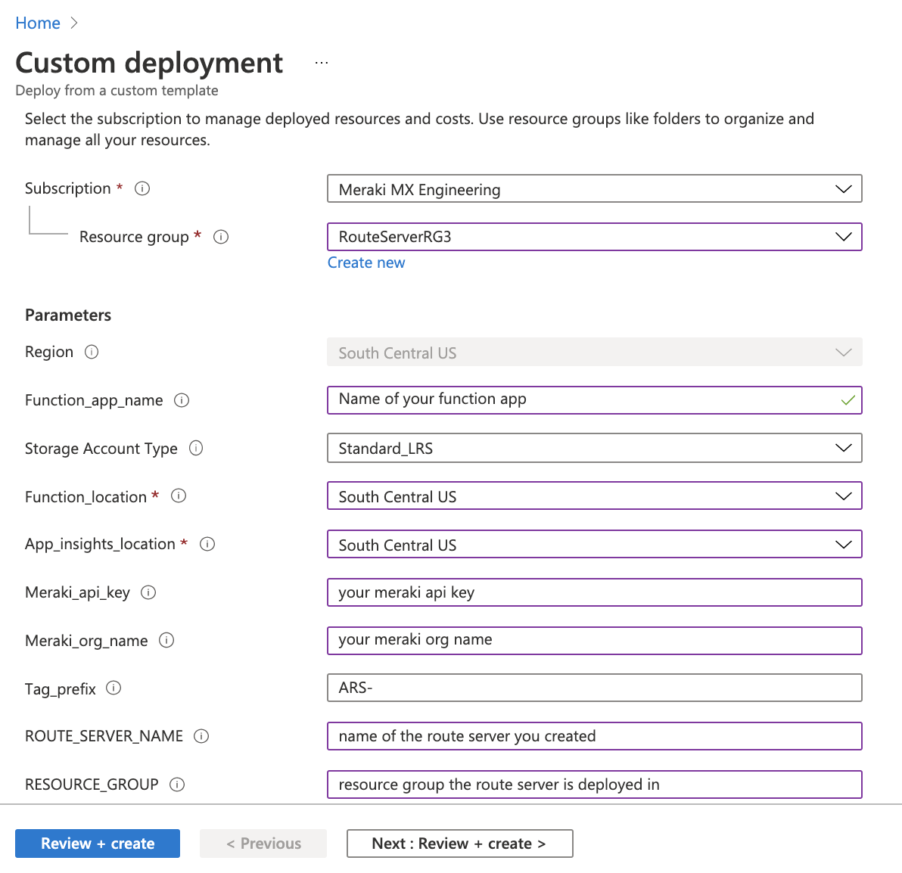

- Click Create on the Summary blade.  

#### Delegate access to the function app in the Azure Portal:  ####

Once the template has finished deploying, the Azure Function will not have any access to your Azure Route Server once provisioned.  To delegate access to Azure Route Server, please complete the following steps. 

- Sign in to the Azure portal with your Azure account. 

- Navigate to your Resource Group that contains your Azure Route Server. 

- Select Access control (IAM), + Add, and select Add Role Assignment. 

- Click the Assign access to dropdown and select Function App 

- Specify the following: 

- Role: Network Contributor 

- Select: Name of your Function App

- Select the service principal 

- Click Save 

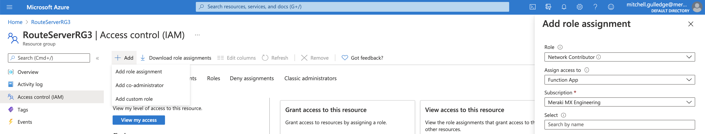

#### Cisco Meraki Workflow ####

Initially, there will be no tagged Meraki networks so the script will sleep and perform the same GET to obtain any networks with the relevant tag. In order to deploy a new branch, the user would navigate to Organization > Overview and select the checkbox next to the network that you wish to connect. Below is a snippet of the Meraki Dashboard Overview page:  

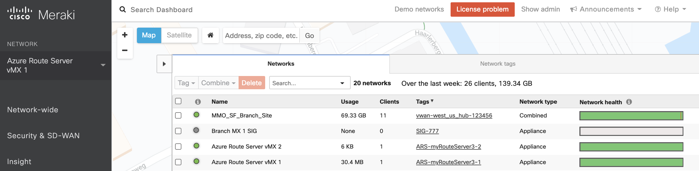

Once the network is tagged appropriately, BGP peering is then automatically configured between ARS and the vMX. 

#### Tag Naming Convention ####

In order for the function to properly detect new NVAs to be BGP peered to Azure Route Server the following syntax must be applied:

```
Tag template = ARS-unique identifier (letter/number)
Actual tag value = ARS-routeserver-1
```

#### FAQ ####

Q: How do I ensure the automation remains working if I generate a new Meraki API Key? 

A: You can navigate to the Azure Function in the Azure Portal and select Configuration under Settings.  Under Application settings, modify the value for the setting called meraki_api_key. 

Q: The automation doesn’t seem to be doing anything, how do I figure out what’s going on? 

A: The Azure Function will log many points of execution to help facilitate troubleshooting.  Navigate to your Function App, select Functions, choose your function app, and click Monitor.  On the Monitor blade, you can select any of the run dates and see the logging information as the code executes.  In many cases, a Type of Error will be logged at points where the script reaches out to make API calls. 

Note: Logs may take up to 5 minutes display after the script has executed. Below is a screenshot of the monitor tab once you clicked into the function:

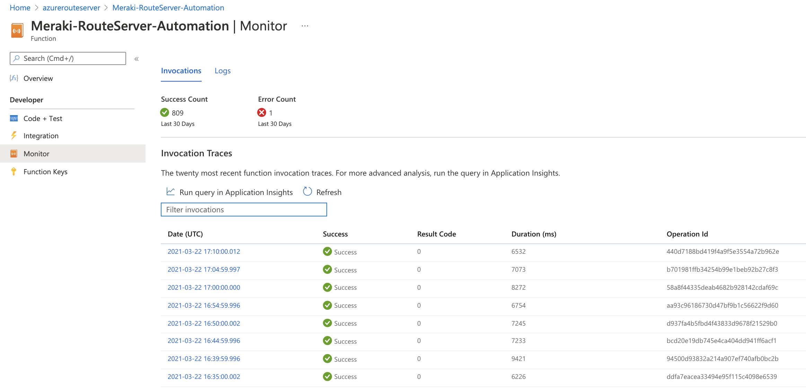
`
# References

Below link on deploying Meraki BGP:
https://documentation.meraki.com/MX/Networks_and_Routing/BGP

Link on the Azure Route Server:
https://docs.microsoft.com/en-us/azure/route-server/overview
